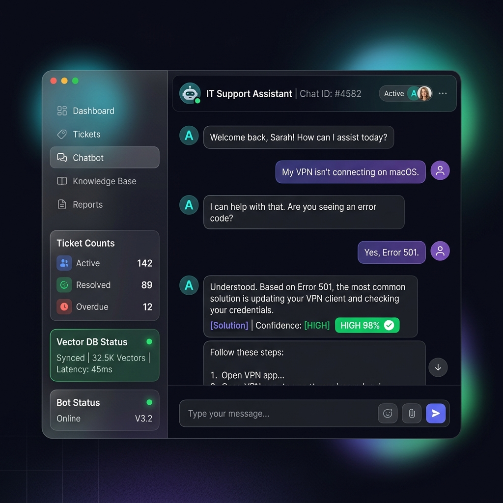

# L0 IT Helpdesk Self-Service KB Chatbot

An automated, production-ready Level-0 (L0) IT support self-service assistant. This application reads standard operating procedures (SOPs) written in Markdown, generates dense vector representations locally using `SentenceTransformers`, indexes them into a persistent `ChromaDB` database, runs grounded completion queries using `Google Gemini API`, and triggers automated service ticketing classifications if confidence scores fall below threshold rules.

#Demo Video Link:
https://drive.google.com/file/d/1N56CeIrp5HlCsD2pDbpBKcyzB7Slowdc/view?usp=sharing


# Team members
1.Lingareddy Sujitha
2.Kommi Sindhu
3.Kuruva Parashuram
4.Kondreddigari Jhnavi


## 1. Problem Statement
Internal IT Service Desk teams are frequently overwhelmed by high volumes of repetitive, low-complexity Level-0 (L0) inquiries (e.g., forgotten password reset steps, VPN configurations, and local office printer setups). Resolving these manually consumes valuable IT engineering hours, raises operational overhead, and results in delayed response rates for end-users. 

This project solves this bottleneck by providing a highly accurate, fully grounded, self-service retrieval-augmented generation (RAG) assistant. It ensures that the bot only answers if high-quality policy documentation exists, and gracefully escalates to a human engineer with an auto-generated, categorized support ticket if it cannot resolve the issue confidently.

---

## 2. Architecture
The chatbot operates on a decoupled modular architecture:

```
sd01-kb-chatbot/
├── app.py                     # Streamlit frontend orchestrator
├── requirements.txt           # Python packages
├── README.md                  # Detailed project documentation
├── prompts.md                 # System and user prompt definitions
├── ai_usage_note.md           # AI implementation reference note
│
├── data/
│   ├── kb/                    # Input Markdown files (SOP articles)
│   └── tickets.csv            # Local CSV ticket database
│
├── outputs/
│   ├── chat_history.json      # Logs of active chat sessions
│   └── escalated_tickets.csv  # Backup repository of escalated tickets
│
├── src/
│   ├── utils.py               # Constants, directories, and markdown header chunker
│   ├── embeddings.py          # Local SentenceTransformers wrapper (all-MiniLM-L6-v2)
│   ├── rag_engine.py          # Persistent ChromaDB collection controller
│   ├── llm_helper.py          # Gemini API connector and JSON validation schema
│   └── ticket_handler.py      # Ticketing CSV log generator
│
└── tests/
    └── test_rag.py            # Pytest test cases (Happy & Negative paths)
```

### Flow Diagram:
1.  **Ingestion**: `MarkdownParser` scans `data/kb/` -> splits files by H1/H2/H3 headers -> generates 384-dimensional dense vectors using local `EmbeddingEngine` -> indices inserted in `ChromaDB` (configured for Cosine Similarity).
2.  **Retrieval**: User query -> converted to query vector -> top 3 nearest-neighbor chunks retrieved from ChromaDB.
3.  **Grounding & Verification**: Question + Chunks sent to Gemini `gemini-1.5-flash` with zero temperature (`temperature = 0.0`) -> returns structured JSON.
4.  **Escalation**: If vector similarity $< 0.70$ or LLM confidence score $< 70$, an inline **Escalate** button appears. Clicking it requests contact details, calls Gemini's classifier to output structured ticket fields, and logs it to CSV files.

---

## 3. UI Mockup


---

## 4. Setup

### Prerequisites
*   Python 3.11 or higher.
*   macOS Command Line Tools (repaired via terminal command: `xcode-select --install` if python path warnings arise).

### Installation Steps:
1.  Navigate to the project root:
    ```bash
    cd /Users/ramadevisannapureddy/Documents/sd01-kb-chatbot
    ```
2.  Create and activate a python virtual environment:
    ```bash
    python3 -m venv venv
    source venv/bin/activate
    ```
3.  Install all dependencies:
    ```bash
    pip install -r requirements.txt
    ```
4.  Create a `.env` file in the project root containing your Gemini API key:
    ```env
    GEMINI_API_KEY=your_actual_google_gemini_api_key_here
    ```

---

## 5. Running Locally

### Run Automated Pytest Suite
Execute the pytest suite to verify Happy-path and Negative-path checks for parser chunking, vector searching, LLM grounding responses, and ticket generation:
```bash
pytest -v tests/test_rag.py
```

### Start the Chatbot
Launch the Streamlit web dashboard:
```bash
streamlit run app.py
```
1.  Open the web interface (usually `http://localhost:8501`).
2.  Under the sidebar, click **Ingest & Re-index** to index the 20 sample files in the database.
3.  Start submitting questions.

---

## 6. Sample Input & Output

### Scenario A: Grounded Query (High Confidence)
*   **Sample Input (Question)**: 
    > How do I configure FortiClient VPN remote settings?
*   **Sample Output (Structured Answer)**:
    ```json
    {
      "answer": "To configure FortiClient VPN:\n1. Open FortiClient and select Configure VPN.\n2. Set VPN Type to SSL-VPN.\n3. Input Connection Name (e.g. Corporate Network).\n4. Set Remote Gateway to vpn.company.com and Port to 10443.\n5. Click Save. [Source: kb03_vpn_install_forticlient.md, Section: H1: FortiClient VPN Installation and Setup > H2: Installation Steps]",
      "confidence": 98,
      "citations": [
        "kb03_vpn_install_forticlient.md > H1: FortiClient VPN Installation and Setup > H2: Installation Steps"
      ]
    }
    ```

### Scenario B: Ungrounded Query (Low Confidence / Ticket Generated)
*   **Sample Input (Question)**: 
    > Can I order an office standing desk from the portal?
*   **Sample Output (Confidence < 70 Fallback)**:
    ```json
    {
      "answer": "I could not find this in the knowledge base.",
      "confidence": 0,
      "citations": []
    }
    ```
*   **Generated Ticket Payload**:
    ```json
    {
      "ticket_id": "TKT-1001",
      "ticket_title": "Standing Desk Request Info",
      "problem_summary": "User is asking for guidelines to order an office standing desk. No matching documents exist in the IT KB.",
      "priority": "Low",
      "recommended_team": "Facilities IT Services"
    }
    ```

---

## 7. AI Capability Demonstrated
*   **Local Vector Generation**: Eliminates operational network costs for document encoding.
*   **Structured Output Schemas**: Restricts model responses to exact JSON validation rules, preventing markdown parsing failures.
*   **Zero Temperature Determinism**: Restricts LLM generation strictly to context details, eliminating hallucinations.
*   **Automated Priority & Routing**: Analyzes user text to automatically determine severity rating (Low/Medium/High) and assign tickets to the correct IT queue.

---

## 8. Assumptions
*   All knowledge base articles are written in Markdown and contain structural `#` or `##` headers.
*   Active internet connection is available for communicating with the Google Gemini API completion services.
*   A valid `GEMINI_API_KEY` is provided either via `.env` or input dynamically in the sidebar.

---

## 9. Limitations
*   **Offline Operation**: While embeddings generation is local, final text synthesis and ticket generation require active API connections.
*   **Workstation Latency**: First-time loading of the `SentenceTransformers` model (`all-MiniLM-L6-v2`) requires downloading a 90MB file.
*   **Language support**: Ingestion logic is optimized for English Markdown syntax. Multi-lingual structural documents may require alternate tokenizer models.
